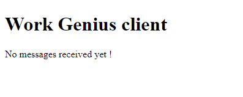
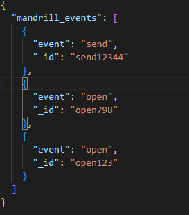
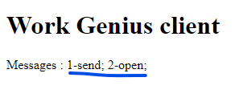

WorkGenius WebHook Mandrill
================================

|Python-Versions| |pip-Version| |flask-Version| |redis-Version| |flask-socketio| |pytest-Version| |mock-Version|
|black-Version| |isort-Version| |flake8-Version| |mypy-Version|

``WorkGenius Assignment`` is a Flask Backend application that listens to POST requests from Mandrill and send Websockets data to connected clients. 
In fact, Mandrill sends a standard HTTP post request with the parameter ``mandrill_events`` which is a `JSON Array <https://gist.github.com/adrienTchounkeu/af41ad8426f9d68c84429458c4739e71>`_ of webhooks events, messages
events in particular. The Backend now listens and process this JSON data. First, it stores into a Redis cache and then sends this information to the 
connected clients via Websockets. 

--------------------------------------

.. contents:: Table of contents
   :backlinks: top
   :local:

Technologies used and Why ?
---------------------------

To resolve this problem, we have used ``flask``, ``flask-socketio``,
``redis`` , ``socketIO`` , ``black`` , ``isort`` , ``mypy`` , ``flake8`` , ``pytest`` and ``mock``.

* ``flask``: among the best python web frameworks, it perfectly suits our situation because it is lightweight and for small projects. 
* ``flask-socketio``: our backend server needs to support Websockets. Flask does, by the use of this extension.
* ``redis``: we are using redis for caching. It helps us to store all our messages.
* ``socketIO``: through this library, the client sends and receives data to/from the server.
* ``pytest``: helps us to test our routes and socket events.
* ``mock``: patchs redis store methods to avoid persistence while testing.
* ``black``: our python code formatter tool.
* ``isort``: sorts our imports alphabetically, and automatically separates into section and by type.
* ``flake8``: our python linting tool.
* ``mypy``: our python type checker tool.

Installation
------------

To run my Backend solution, you must have ``python``,  ``pip``, ``redis-server`` installed in your system and configure
the redis server with our flask application.

Download the project from GitHub
~~~~~~~~~~~~~~~~~~~~~~~~~~~~~~~~~

To clone my code, run the command below in the CLI

.. code:: sh

    git clone "https://github.com/adrienTchounkeu/workgenius.git"

You can also download the project by clicking the link `WorkGenius webhook <https://github.com/adrienTchounkeu/workgenius.git>`_

Install Dependencies
~~~~~~~~~~~~~~~~~~~~~

After downloading the code, open the CLI in the root directory and execute the command :

.. code:: sh

   pip install -r requirements.txt

NB: *"requirements.txt is a file which contains all the project dependencies"*

After all the project dependencies are installed, run the command

.. code:: sh

   python run.py # on Windows

or

.. code:: sh

   python3 run.py # on Linux and Mac

To run the Redis server, follow this link `Install & Run Redis <https://redis.io/docs/getting-started/>`_

NB: *The server generally starts on the port 5000*

Frontend App(Client)
~~~~~~~~~~~~~~~~~~~~~

* The CLient is a simple index.html page that is served by the flask backend from the endpoint ``/``. You can access through the link `CLient App <https://github.com/adrienTchounkeu/workgenius/tree/master/templates>`_

Analyzing The Solution
----------------------

Before starting coding, we have to understand the problem and think of the solution. We have structured our project as follow :

* Choose a great backend framework that supports websockets : Flask for instance
* Create customs events to dispatch upon connection and send data action
* Mandrill is sending an array of events. We need to send less and readable information to the client. See this function `count_messages_by_event <https://github.com/adrienTchounkeu/workgenius/blob/master/helpers/messages.py#L23>`_
* A simple cache server : Redis for instance

Solving ``WorkGenius WebHook``
-------------------------------------------

Assumptions
~~~~~~~~~~~

To solve the problem, we did some hypothesis:

* The JSON data sent by Mandrill has this format `mandrill_events <https://gist.github.com/adrienTchounkeu/af41ad8426f9d68c84429458c4739e71>`_

Solution
~~~~~~~~~~~

We used ``flask``, ``socketIO`` and ``redis`` to:

* listen for connection with Client and log successfully connection messages
* create POST endoint ``/message-events`` to process data sent from Mandrill
* store all the messages events in redis(check **db/cache.py**). For each message, the redis key associated is the `_id` of the message
* compute the JSON array and regroup it by event type. See the `count_messages_by_event <https://github.com/adrienTchounkeu/workgenius/blob/master/helpers/messages.py#L23>`_ function in **helpers/messages.py** 
* send the obtained dictionnary to the client
* display on client

Flow
~~~~~

* After running the server with `python run.py` and having the serving listening on 5000, you can walk through the endpoint ``/`` and you will see the client 

  
* A connection is then established between client and the server. The server receives data from the client upon connection. You can check the logs on server and you will see : ``helpers.logger - INFO - Client is connected with message : {'data': "Client's connected!"}``
* To simulate a POST request from Mandrill, I will send the following payload to the API 

* Two messages are logs by the server, respectively upon redis persistence confirmation and notification events sent to client. ``helpers.logger - INFO - Mandrills Events successfully stored on Redis`` and ``helpers.logger - INFO - Events sent to Client``
* The client then displays the number of emails for each type of event 

Tests
~~~~~

Tests were performed in the project. Please see under `tests/`. 
You need to have pytest installed in your environment before running tests. 

.. code:: sh

    pytest tests/

Further perspectives
---------------------

Security
~~~~~~~~

We can add more security to this application with these two options : 

* Add CORS on the POST route to only allow receiving requests from `mandrillapp.com`. *I intentionnaly omit it for testing purposes*
* Mandrill recommends authenticating webhook requests by comparing signatures. See the link below `Authenticating WebHook Requests <https://mailchimp.com/developer/transactional/guides/track-respond-activity-webhooks/#authenticating-webhook-requests>`_

Limitations & Optimizations
~~~~~~~~~~~~~~~~~~~~~~~~~~~

Even though my code is solving the problem, I have some performance and resources used issues.
To optimize my solution, I think

* implement connection Pool to handle multiple connections
* In case, we have different types of information to share among different types of users/clients: implement rooms to group certain types of users
* control the amoung of data store on redis as Redis is having some size limit
* Add Celery to process redis storage. In fact, when storing messages in redis, it is better to pass this task to a seperate worker.

.. |Python-Versions| image:: https://img.shields.io/badge/python-3.10.6-blue   :alt: Python Version
.. |pip-Version| image:: https://img.shields.io/pypi/v/pip?label=pip&logoColor=white   :alt: pip Version
.. |flask-Version| image:: https://img.shields.io/pypi/v/flask?label=flask&logo=flask   :alt: flask Version
.. |flask-socketio| image:: https://img.shields.io/pypi/v/flask-socketio?color=p&label=flask-socketio
.. |pytest-Version| image:: https://img.shields.io/pypi/v/pytest?label=pytest&logo=pytest   :alt: pytest Version
.. |mock-Version| image:: https://img.shields.io/pypi/v/mock?label=mock&logo=mock   :alt: mock Version
.. |black-Version| image:: https://img.shields.io/pypi/v/black?label=black&logo=black   :alt: black Version
.. |isort-Version| image:: https://img.shields.io/pypi/v/isort?label=isort&logo=isort   :alt: isort Version
.. |flake8-Version| image:: https://img.shields.io/pypi/v/flake8?label=flake8&logo=flake8   :alt: flake8 Version
.. |mypy-Version| image:: https://img.shields.io/pypi/v/mypy?label=mypy&logo=mypy   :alt: mypy Version
.. |redis-Version| image:: https://img.shields.io/pypi/v/redis?label=redis&logo=redis   :alt: Redis Version
